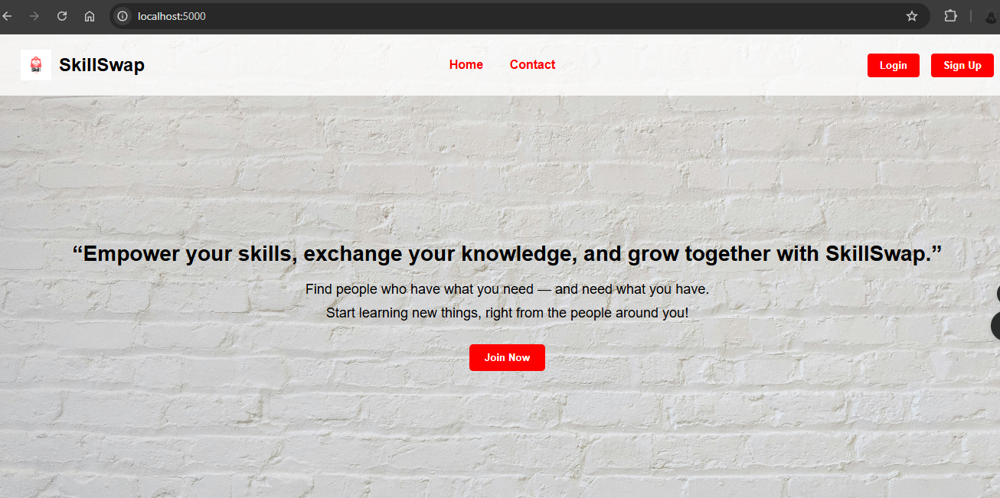
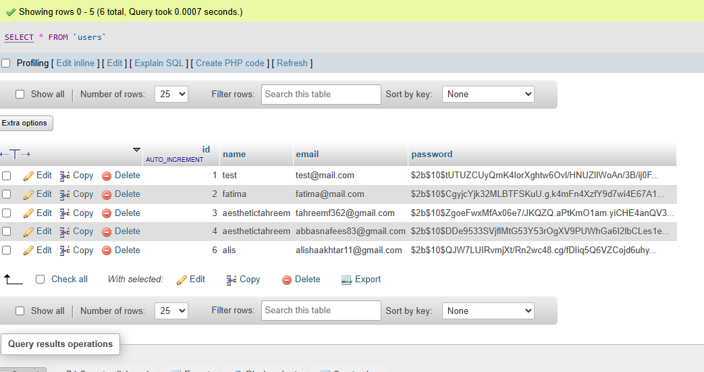

**SkillSwap**




SkillSwap is a *free skill‑sharing platform* where users can:

- 🔹 Create an account (Sign Up)  
- 🔹 Log in to access their *personal dashboard*  
- 🔹 Add their own *skills*  
- 🔹 Discover *other users* and their skills  
- 🔹 Send *swap requests* or *messages* to collaborate  

This project is fully developed using:

- 🎨 *HTML / CSS / JavaScript* (Frontend)  
- ⚡ *Node.js + Express* (Backend)  
- 🗄 *MySQL Database*  
- 🔒 *JWT Authentication* for login sessions  

---

## 📸 Project Screenshots

### 🏠 Homepage


### 📞 Contact Navigation


### ✍ Sign Up Page


### 🔐 Login Page


### 📊 Dashboard Page


### 🗄 Database Structure


---

## ⚙ Features

- 🆕 *Sign Up & Login* with JWT authentication  
- 💾 *MySQL Database* to store user info and skills  
- 🔄 *Skill Swap Requests* between users  
- 💬 *Messaging Feature* in dashboard  
- 🎨 *Responsive UI* with background images and clean design  
- 🌐 *Ready to Deploy* on free hosting (Netlify + Render)  

---

## 🛠 Tech Stack

| Area         | Technology            |
|--------------|----------------------|
| *Frontend* | HTML, CSS, JavaScript |
| *Backend*  | Node.js, Express.js   |
| *Database* | MySQL                 |
| *Auth*     | JWT + Bcrypt          |

---

## 🚀 How to Run Locally

1. *Clone this repo*
   ```bash
   git https://github.com/tahreemf362/SkillSwap-
   cd SkillSwap

2. Install Dependencies

npm install


3. Create a .env file in the root folder:

PORT=5000
DB_HOST=localhost
DB_USER=root
DB_PASSWORD=your_password
DB_NAME=skillswap
JWT_SECRET=your_secret_key


4. Start the Server

node server.js


5. Open in browser:

http://localhost:5000


---

👩‍💻 Author

Tahreem Fatima
📧 Email: tahreemf362@gmail.com
🎓 4th Semester BS Software Engineering, PMAS Arid University
